# Supplementary figures (S1–S13)

Figures moved out of the main manuscript when it was condensed to the 5-page
limit (R. Guymon, PR #3, 2026-07-08). All image files are rendered
reproducibly by the `paper/build_*.py` scripts (`make figures`); the main
text's data figures are the lab's actual uploaded records, extracted verbatim
by `paper/extract_uploaded_figures.py`. The main text points here wherever a
figure was removed. Table S1 (the specimen–run
cross-reference) is in [`specimen-run-linkage.md`](specimen-run-linkage.md).

## Hardware

**Figure S1 — Disassembled graphite crucible.**
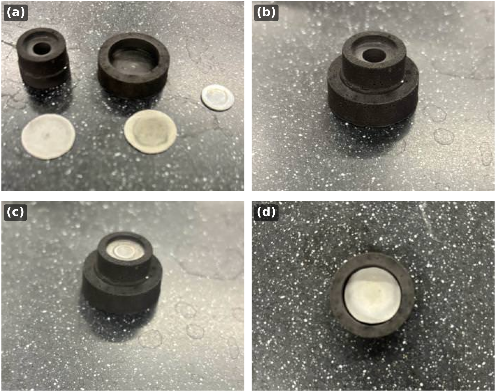
Fully disassembled graphite crucible. Top left is the crucible lid, top middle
is the bottom of the crucible that acts as the specimen carrier, far right is
the sapphire window, bottom left and middle are the alumina
sample-surrounding sheets.

**Figure S2 — Measured crucible-stack dimensions.**
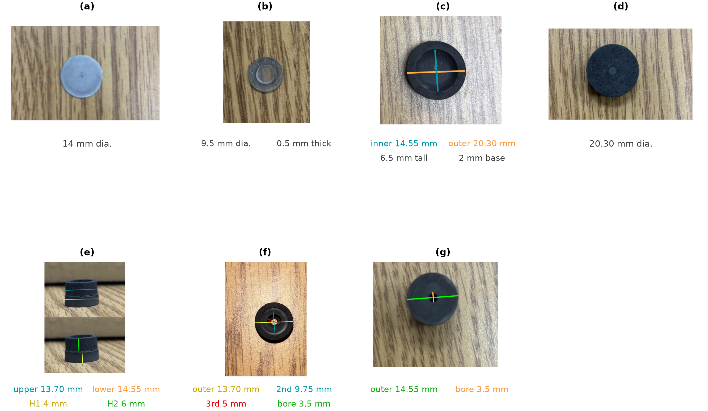
Measured dimensions of each part of the graphite crucible/susceptor stack,
with the coloured measurement lines drawn on the corresponding photograph.
(a) Alumina spacer disc, 14 mm dia. (b) Sapphire pyrometer window, 9.5 mm
dia., 0.5 mm thick. (c) Crucible body, top: machined sample cavity 14.55 mm ID
(teal), 20.30 mm OD (orange); the cup is 6.5 mm tall with a 2 mm base.
(d) Crucible body, bottom face, 20.30 mm dia. (e) Crucible lid, oblique: the
stepped plug seats into the cavity — 13.70 mm upper step (teal), 14.55 mm
lower shoulder (orange); the upper step is 4 mm tall (H1, yellow) and the
lower shoulder 6 mm tall (H2, green). (f) Crucible lid, top: four concentric
steps of 13.70 mm (outermost), 9.75 mm, 5 mm, and a 3.5 mm central
pyrometer-sighting bore. (g) Crucible lid, bottom: 14.55 mm seating face
(green) and the 3.5 mm through-bore (orange). Fully assembled the stack stands
13 mm tall.

**Figure S3 — Work-coil fabrication drawing.**
See [`docs/coils-drawing.pdf`](../../docs/coils-drawing.pdf).
Work-coil fabrication drawing used for the CEIA build, showing the coil
geometry and dimensional callouts used to form and mount the liquid-cooled
copper coil around the quartz chamber.

**Figure S4 — Vacuum and gas-handling details.**
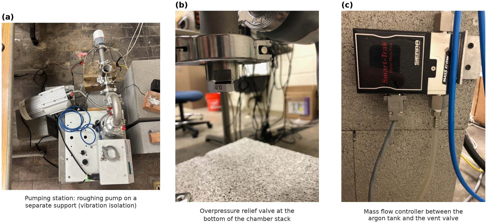
(a) Turbo pumping station with the roughing pump mounted on a separate
support, coupled to the pumping station only through a flexible hose, so pump
vibration is not transmitted into the chamber. (b) Overpressure relief valve
(0.5 psi cracking pressure) at the bottom of the vacuum chamber stack.

## Thermal performance

**Figure S5 — Power-command → temperature calibration.**
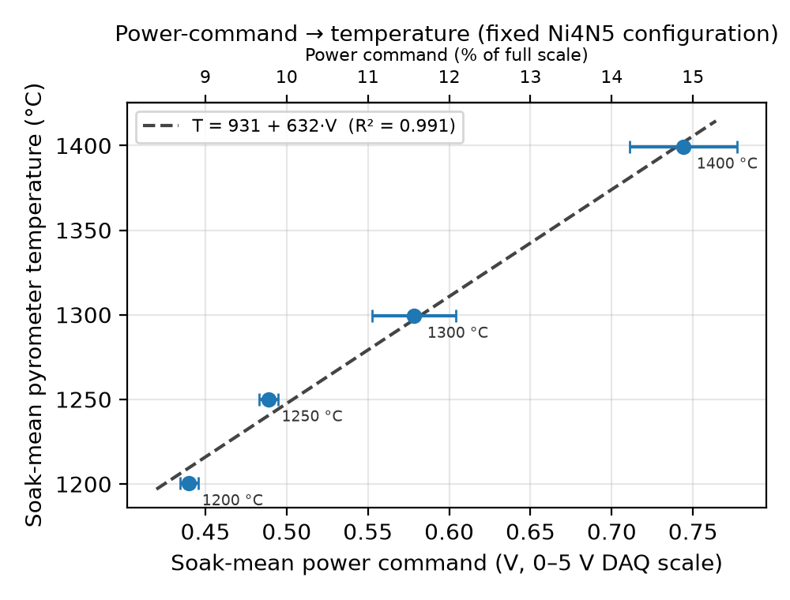
Calibration for one fixed archived Ni4N5 configuration. Points are soak-mean
values; horizontal bars are the in-soak SD of the analog command. The dashed
line is the linear operational calibration (R² = 0.991, n = 4).

**Figure S6 — Representative closed-loop anneal.**
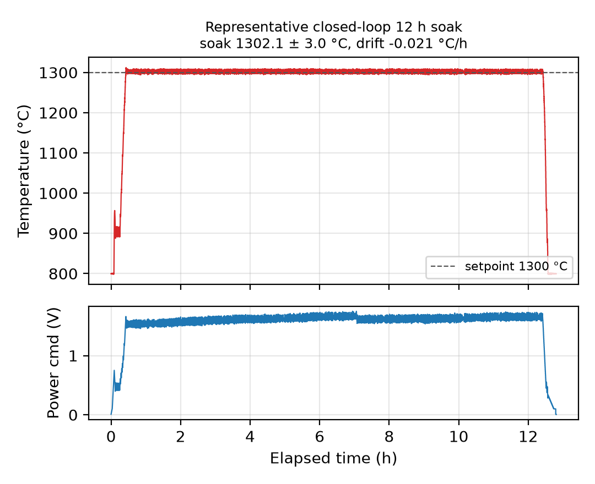
Representative closed-loop anneal (Ni4N5, nominal 1300 °C / 12 h): pyrometer
temperature with setpoint overlay (top) and analog power command (bottom).
Soak mean 1302.1 ± 3.0 °C, drift −0.02 °C/h.

**Figure S7 — Run-to-run repeatability.**
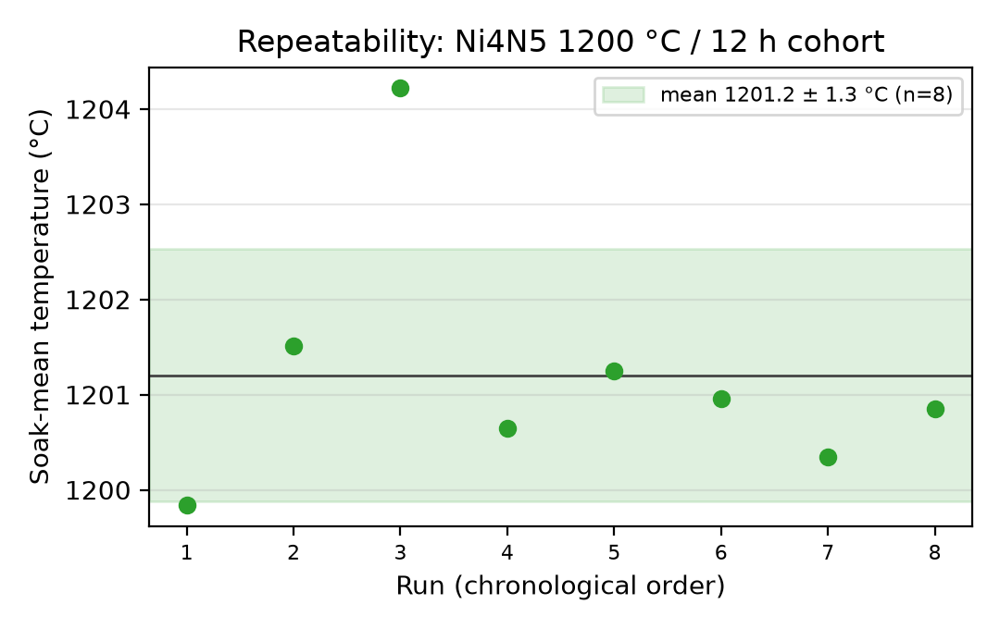
Repeatability of the Ni4N5 1200 °C / 12 h cohort (n = 8). Points are per-run
soak-mean temperatures; the band is mean ± SD (1201.2 ± 1.3 °C).

**Figure S8 — Long-duration thermal stability.**
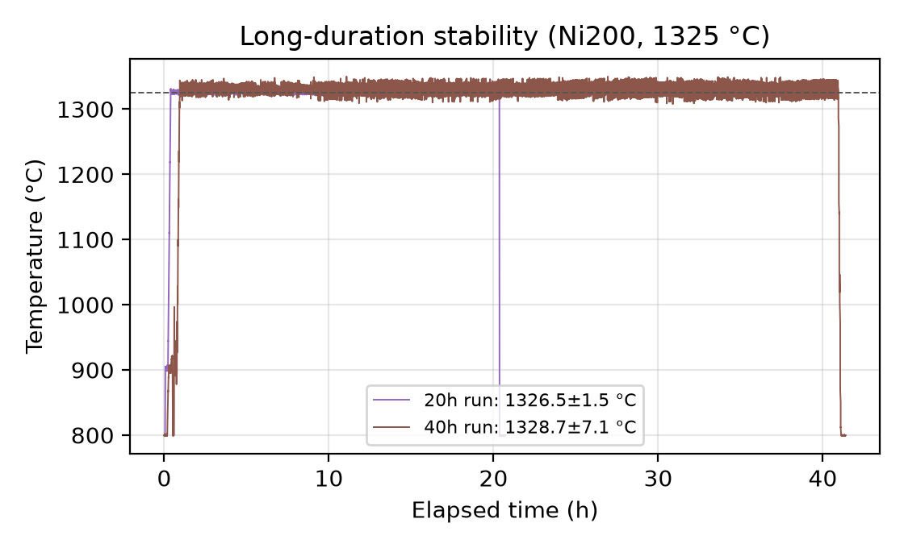
Ni200 anneals at 1325 °C held for 20 h and 40 h.

## Microstructure

**Figure S9 — EBSD orientation maps.**
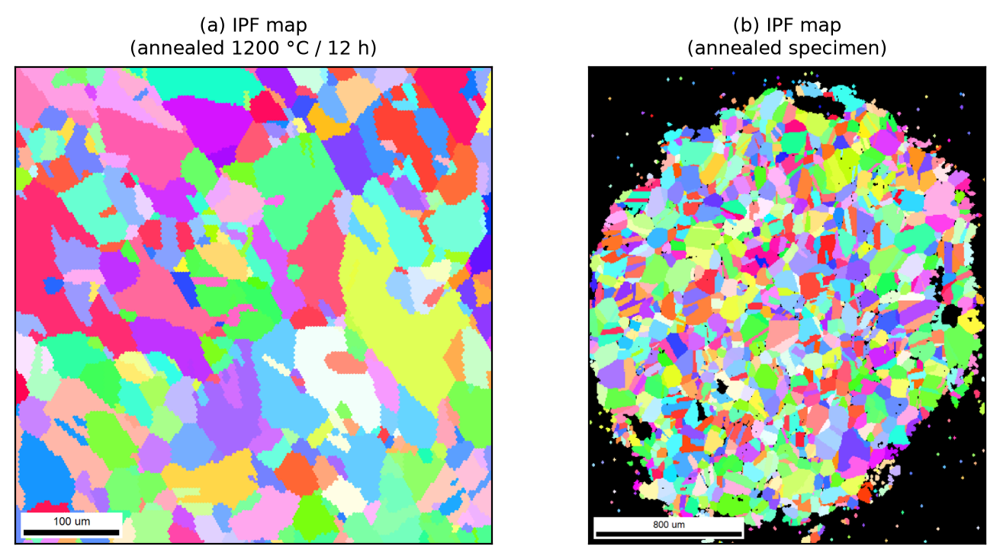
EBSD inverse-pole-figure (IPF) orientation maps of two annealed Ni4N5
specimens, rendered from the archived EBSD scans. (a) `Ni4N5_034` (annealed at
1200 °C / 12 h); (b) `Ni4N5_069`. Each indexed color is a crystallographic
orientation; the maps resolve hundreds of grains for grain-size and texture
analysis.

**Figure S10 — Raw (as-collected) Kikuchi patterns.**
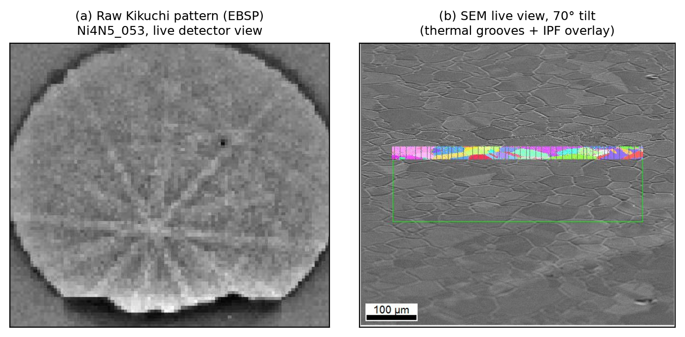
Raw EBSD acquisitions from furnace-annealed nickel, with no metallographic
preparation. (a) Raw Kikuchi pattern (electron backscatter pattern) of
specimen `Ni4N5_028` as seen live on the detector at 8×8 binning (30 ms
exposure), with Kikuchi bands and zone axes crisply resolved; (b) the
corresponding SEM live view at 70,068×, where thermal grooving alone
delineates the grain boundaries crossed by the EBSD line scans (red marks;
1 µm scale bar). (c–e) Representative per-scan-point raw patterns (115×115 px
at 8×8 binning) saved automatically during EBSD mapping of the early-campaign
specimens `Ni_003b1a` and `Ni_003a1b`; more than 100,000 such patterns are
archived.

**Figure S11 — Grain-boundary thermal grooving.**
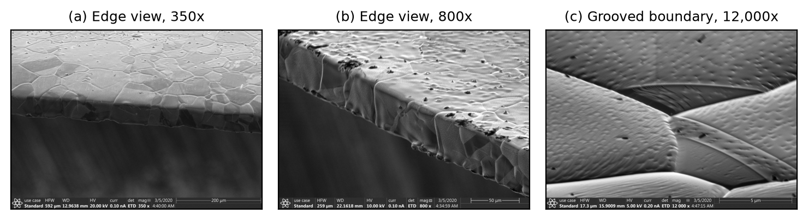
Grain-boundary thermal grooving on specimen `Ni4N5_053` after a
1200 °C / 12 h anneal, imaged edge-on in the as-annealed condition (ultrasonic
ethanol clean only; no polishing). (a) Edge view at 350× (200 µm scale bar):
several grain boundaries traverse the full sheet thickness. (b) Edge and top
surface at 800× (50 µm scale bar), with grooves outlining the surface grain
structure. (c) A single grooved boundary at 12,000× (5 µm scale bar): the
deep trench develops as grain-boundary energy equilibrates against surface
energy at the soak temperature.

## YSZ / high-temperature extension

**Figure S12 — Tantalum-susceptor heat curves.**
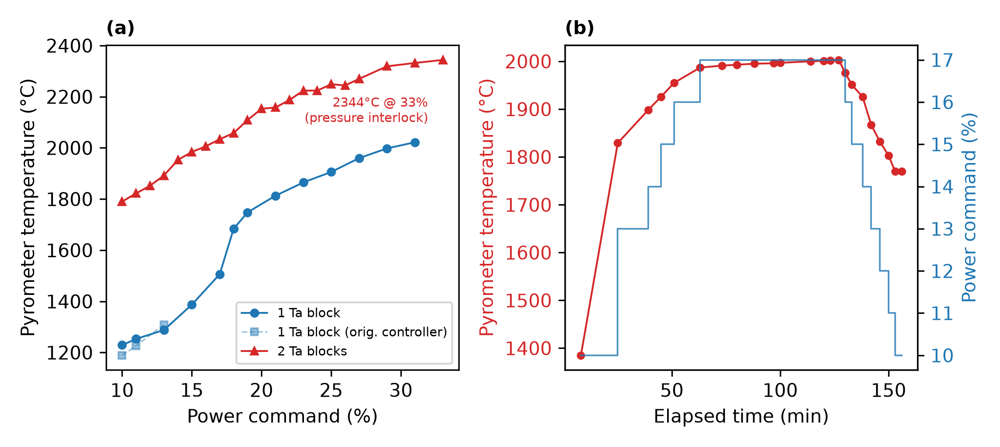
Measured heat curves of the tantalum-susceptor (ceramic) stack. (a) Pyrometer
temperature vs. generator power command for one and two stacked tantalum
susceptor blocks (the faint series repeats the single-block measurement on
the original power controller); the two-block ramp reached 2344 °C at a 33 %
command before the chamber pressure interlock ended the test. (b) Timed
two-block ramp/soak: a constant 17 % command holds ~2000 °C (2000 ± 3 °C over
the final hour) before a stepped ramp-down.

**Figure S13 — YSZ charge stack and resulting microstructure.**
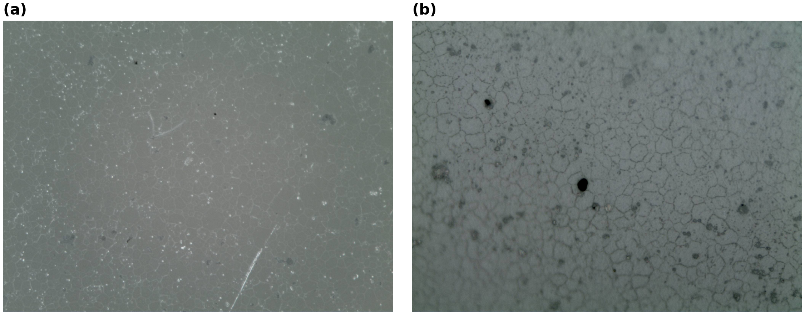
(a) Charge-stack schematic: inside a fresh ~35 mm-ID quartz tube, the YSZ
specimen (red) is sandwiched between two 25.5 mm tantalum susceptor blocks,
resting on a 28 mm ceramic heat-dissipation stub (boron nitride for best
results, sometimes MgO) on an alumina support rod that raises the stack to
coil height; the coil, vacuum, pyrometer, and control paths are unchanged
from the metal configuration. (b) Optical micrograph of YSZ after a
1700 °C / 10 h anneal. (c) Optical micrograph of an induction-annealed YSZ
specimen, showing the equiaxed grain structure.
